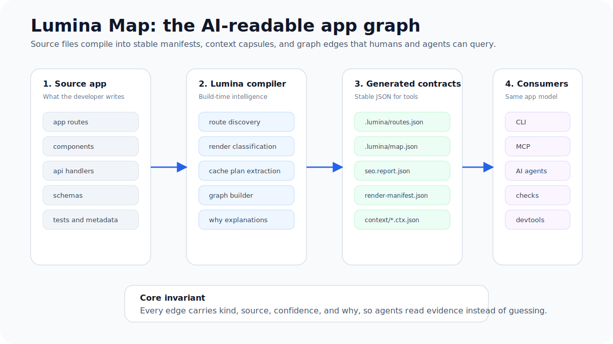
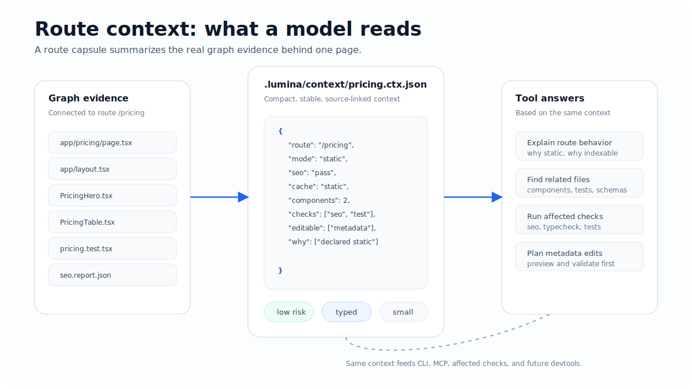
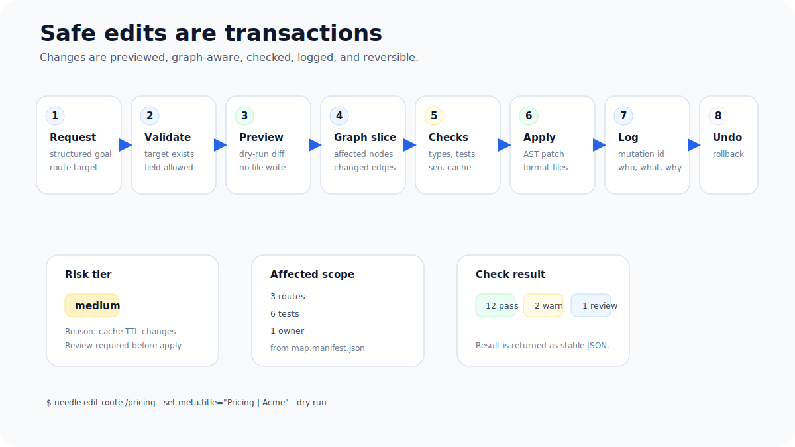

# Lumina

**The app-graph-native, agent-native, SEO-first React framework for large applications.**

Lumina illuminates the structure of modern React apps. It gives developers familiar framework ergonomics while making routes, render modes, cache plans, SEO surfaces, tests, ownership, generated files, and agent-safe edit boundaries visible through the Lumina Map.

Your app ships with a map.

Build like Next.js.

Type like TanStack Start.

Work with agents through structured contracts instead of guesswork.

Ship static when possible with Bun and Vite leverage, and make every dynamic path explain why it exists.

<p align="center">
  
</p>

Lumina is an app-graph-native, SEO-first React framework for building fast, large-scale web applications with a semantic map of every route, component, API, schema, test, cache, content, ownership, and risk relationship.

The goal is not to clone Next.js. The goal is to win a newer category:

> The React framework where your app ships with a map.

## Current Repository Status

Lumina is moving toward Alpha. This checkout is in Phase 1: monorepo scaffold with the first compiler route-discovery slice implemented. The product language below describes target framework behavior unless a section explicitly marks behavior as current.

Lumina is preparing an MVP Alpha focused on route discovery, explicit render modes, the first Lumina Map output, CLI inspection, and the first dev/build/start path. The current repository has route discovery in `@lumina/compiler`, generated `.lumina/routes.json`, `.lumina/render-manifest.json`, and `.lumina/map.json` output, the first route and inspect CLI paths, a minimal `lumina map affected` query, `lumina bench --list --json`, minimal `lumina dev`, static `lumina build`, and static `lumina start` paths; broader MVP commands below are target behavior until implementation and fixture evidence exist.

Current implemented scope is the Bun workspace scaffold, package placeholders, contract-backed shared core model types, `@lumina/react` `staticPage()` and `ssr()` render helpers, `@lumina/compiler` route discovery and explicit static/SSR render-mode extraction, compact `.lumina/routes.json`, `.lumina/render-manifest.json`, and `.lumina/map.json` generation with direct local import edges, `bun run lumina -- routes <appPath> --json`, `bun run lumina -- inspect <appPath> --json`, `bun run lumina -- inspect <appPath> why <route>`, `bun run lumina -- map affected <appPath> <file> --json`, `bun run lumina -- bench --list --json`, `bun run lumina -- dev <appPath>`, minimal Vite SSR dev serving for static, dynamic, and catch-all page routes with page `params` and `searchParams`, app-level and route-level `not-found.tsx` / `error.tsx` rendering in dev, first dev client hydration bundles under `.lumina/client/*.js`, browser-verified interactive dev hydration for the `apps/www` root route, `virtual:lumina/routes`, route-file artifact regeneration with `.lumina/hmr-report.json`, `bun run lumina -- build <appPath>` static HTML output with route-specific production client bundles under `dist/public/_lumina/client/*.js`, `bun run lumina -- start <appPath>` static built-output serving through `@lumina/adapter-bun` with no source route files required on the request path, tested static HTML and client asset cache headers, stable 404s, and sanitized malformed-path responses, browser-verified interactive production hydration for the built `apps/www` root route, `.lumina/build-trace.json`, `.lumina/perf.report.json`, deployment manifest copies under `dist/`, scaffolded `apps/www` and example fixtures, early benchmark/status skeletons with `not implemented` status, CI, and verification scripts. Measured benchmark results, benchmark execution commands, SSR/API production behavior, component-level HMR, broader Lumina Map query modes, MCP tools, and safe edits remain planned.

Package manifest versions currently use `0.0.0` as private scaffold placeholder metadata. No packages are published, and these placeholder versions are not release tags, published package versions, or compatibility guarantees.

The next documentation and prototype target is [MVP Alpha Scope](docs/mvp-alpha-scope.md): route discovery, explicit render modes, first Lumina Map output, CLI inspection, and a demo app. Anything outside that scope remains future unless the scope document changes in the same pull request.

## MVP Alpha Target

MVP Alpha should prove:

1. A small app can be created from the Lumina starter target.
2. `app/` routes are discovered deterministically.
3. Static and basic SSR render modes are explicit.
4. `.lumina/routes.json`, `.lumina/render-manifest.json`, and `.lumina/map.json` are generated.
5. `lumina routes --json`, `lumina inspect --json`, and `lumina inspect why` explain the app.
6. A demo app shows why the Lumina Map matters for humans and agents.

See [MVP Alpha Scope](docs/mvp-alpha-scope.md).

## Product Thesis

Modern React applications fail when they become too large to reason about. Routes drift away from tests, components drift away from schemas, SEO regressions hide inside client-heavy rendering, cache behavior hides behind framework magic, and AI agents waste context guessing how files relate to each other.

Lumina exists to make the framework itself the map of the application.

## The Map

Lumina Map is the AI-readable app graph. It connects routes, layouts, components, APIs, schemas, tests, metadata, cache tags, generated files, owners, and risk into stable JSON contracts.

The point is not a pretty visualization. The point is that every tool reads the same evidence.

<p align="center">
  
</p>

A route context capsule gives humans and AI agents the exact slice of the app they need: source files, render mode, SEO status, cache plan, related components, checks, allowed edit surfaces, and `why` explanations.

## Quick Start

Planned command once app creation behavior exists:

```bash
bun create lumina my-app
cd my-app
lumina dev
```

Generated apps should also expose package scripts:

```bash
bun run dev
bun run build
bun run start
```

This repository is not yet at package publication stage. The user-facing create/dev commands above remain target UX rather than verified local commands.

Planned CLI surface:

```bash
lumina dev
lumina build
lumina start
lumina routes
lumina inspect
lumina check
lumina test
lumina seo
lumina map
lumina workspace
lumina agent
lumina mcp
lumina edit
lumina migrate
lumina bench
```

Repository maintenance commands now available in this checkout:

```bash
bun install
bun test
bun run typecheck
bun run docs:check
bun run test:browser
bun run lumina -- routes <appPath> --json
bun run lumina -- inspect <appPath> --json
bun run lumina -- inspect <appPath> why <route>
bun run lumina -- map affected <appPath> <file> --json
bun run lumina -- dev <appPath>
bun run lumina -- dev <appPath> --once
bun run lumina -- build <appPath>
bun run lumina -- build <appPath> --json
bun run lumina -- start <appPath>
bun run lumina -- start <appPath> --once
bun run lumina -- bench --list --json
bun run structure:check
bun run performance:check
bun run check
```

These commands verify the package scaffold, documentation links, root docs metadata, docs navigation coverage, package-map/build-plan/backlog alignment, planned CLI command surface and prefix consistency, status-drift guardrails, config/adapter contract terms, structure rules, shared-core type ownership, shared-core contract terminology, performance-claim guardrails, TypeScript surface, route-discovery fixture behavior, explicit `staticPage()` / `ssr()` render-mode extraction, generated `.lumina/routes.json`, `.lumina/render-manifest.json`, `.lumina/map.json`, direct local import map edges, `.lumina/client/*.js` dev hydration bundles, browser-verified interactive dev and production hydration, `.lumina/hmr-report.json`, `.lumina/build-trace.json`, `.lumina/perf.report.json`, `dist/public/_lumina/client/*.js`, `dist/routes.manifest.json`, `dist/render.manifest.json`, and `dist/adapter.manifest.json` output, `lumina routes --json`, `lumina inspect --json`, `lumina inspect why`, `lumina map affected --json`, `lumina bench --list --json`, minimal `lumina dev` Vite SSR route serving for static, dynamic, and catch-all page routes with page `params`, `searchParams`, not-found components, and error components, `virtual:lumina/routes`, static `lumina build`, static `lumina start`, scaffolded `apps/www` and example fixture route evidence, early benchmark/status skeleton paths, and tests. They do not prove measured benchmark results, benchmark execution commands, SSR/API production behavior, component-level HMR, broader Lumina Map query modes, MCP tools, or safe edits.

## Planned Key Features

- App-graph-native core: Lumina Map, context capsules, stable manifests, MCP read tools, and safe edit transactions.
- Explainable framework behavior: `lumina inspect why` should show why routes are static, SSR, cached, indexable, or risky.
- SEO by default: public routes should ship with meaningful HTML, metadata, sitemaps, structured data, audits, and accessibility-aware diagnostics.
- No invisible caching: every cacheable route, API, component, or function should expose a cache plan and cache tags.
- Hot API paths: generated validators, serializers, and micro-caching for performance-critical API routes.
- Explicit render modes: `staticPage()`, `prerender()`, `ssr()`, `stream()`, `clientOnly()`, ordinary `app/api/` routes, and `apiHot()`.
- Bun and Vite foundation: planned Bun-first adapter paths with frontend ecosystem leverage.
- Large-app safety: ownership, affected checks, dependency graph, route budgets, package boundaries, and risk visibility.
- Agent-safe workflows: safe edits should be AST-based, previewable, logged, check-backed, and reversible.

## Safe Edits

AI agents should not blindly write to a framework app. Lumina's planned edit path is designed as a transaction: validate, preview, regenerate the affected graph slice, run affected checks, apply, log, and support rollback.

<p align="center">
  
</p>

## Positioning

Lumina should be explained in this order:

1. App-graph-native: the framework where the application explains itself.
2. SEO-safe, cache-explicit, and fast by default.
3. Agent-safe workflows through stable JSON, MCP, context capsules, and safe edits.
4. Familiar React meta-framework ergonomics.

## Wedge

Lumina is planned to combine:

- A semantic app map as a first-class framework primitive.
- Explicit render and cache behavior with `why` explanations.
- Next-level routing familiarity.
- TanStack-level type-safety ambition.
- Bun-first adapter paths.
- Vite and Rolldown ecosystem leverage.
- SEO-first public HTML.
- Agent-safe workflows through stable contracts.
- Safe edit transactions instead of free-form agent writes.
- A hot API path for performance-critical endpoints.

## Planned Core Promise

Build like a familiar React meta-framework.

Type like a route-safe full-stack toolkit.

Ship static HTML whenever possible.

Run server paths through a small adapter-aware runtime when needed.

Ask the framework why a route renders, caches, indexes, bundles, or breaks the way it does.

Let humans and agents inspect and modify the app through structured framework data instead of reading the whole repository.

## Planned Differentiators

| Differentiator | Why it matters |
| --- | --- |
| App-graph-native framework core | The planned framework emits a structured map of routes, components, APIs, schemas, tests, SEO, cache tags, ownership, generated files, and risk. |
| Lumina Map | Humans and agents can ask what uses this, what breaks if this changes, which tests should run, and which routes are affected. |
| Explainable render/cache behavior | `why` fields and inspect commands reduce hidden framework magic. |
| SEO engine built in | Public routes should ship with metadata, canonical URLs, sitemap support, robots output, structured data, meaningful HTML, and audits. |
| Route-mode compiler | Every route should compile to static, prerendered, SSR, streaming SSR, client-only, API, or hot API mode. |
| Hot API path | Selected API routes should bypass generic framework handling through generated handlers, validators, serializers, and caches. |
| Agent-safe edit system | Agents should use scoped, previewable, check-backed, reversible transactions rather than broad file edits. |
| Large-app safety | Ownership, affected tests, route budgets, dependency boundaries, and agent permissions should be first-class. |
| Vite ecosystem first | Lumina is planned to use Vite/Rolldown for the frontend build and keep framework intelligence in the Lumina compiler. |

## Strategic Technology Stack

Lumina starts with:

- Bun for package management, test execution, local workflow, and the default production adapter path.
- Vite/Rolldown for React frontend builds, HMR, CSS, assets, and ecosystem compatibility.
- A custom Lumina compiler for route graph, render modes, SEO graph, agent context, app map, API codegen, cache plans, and deploy manifests.
- Adapter packages for production output: Bun first, then Node and static paths early enough to reduce adoption friction.
- Stable JSON manifests as shared contracts for CLI, runtime adapters, MCP, devtools, benchmarks, docs, and agents.
- Additional deployment adapters later.

The framework should avoid building a custom bundler until the app-graph and agent-safe wedge is proven.

## Monorepo Target Structure

```txt
lumina/
  package.json
  bun.lockb
  tsconfig.base.json
  AGENTS.md
  README.md
  VISION.md
  ARCHITECTURE.md
  CONTRIBUTING.md
  packages/
    create-lumina/
    cli/
    core/
    compiler/
    vite-plugin/
    react/
    router/
    seo/
    map/
    agent/
    mcp/
    cache/
    schema/
    devtools/
    adapters/
      bun/
      node/
      static/
  examples/
    basic/
    blog-seo/
    api-route/
    hot-api/
    static-export/
    adapter-node/
    ecommerce/
    dashboard-client/
    agent-demo/
    docs-site/
  playgrounds/
    large-app-fixture/
  tests/
    integration/
    fixtures/
    performance/
  docs/
```

Scaffolded example paths are `examples/basic/`, `examples/blog-seo/`, `examples/multi-app-workspace/`, `examples/large-100-routes/`, and `examples/large-1000-routes/`. Planned future example paths include `examples/api-route/`, `examples/hot-api/`, `examples/static-export/`, `examples/adapter-node/`, `examples/dashboard-client/`, `examples/ecommerce/`, `examples/agent-demo/`, `examples/docs-site/`, and `playgrounds/large-app-fixture/`. These planned paths are target inventory only until the directories, commands, tests, generated artifacts, and status labels exist.

Adapter package paths are `packages/adapters/bun`, `packages/adapters/node`, and `packages/adapters/static`.

## Product Layers

Lumina is built as five layers:

1. Developer framework: file routes, layouts, React rendering, metadata, API routes, and CLI.
2. Compiler: route graph, render modes, server/client splitting, SEO generation, cache plans, codegen, explanations, and manifests.
3. Runtime and adapters: Bun, Node, and static output paths consume generated artifacts and serve built apps.
4. Agent Kernel: app-local `AGENTS.md` generation, context capsules, MCP server, safe edits, plans, and diagnostics.
5. Lumina Map: semantic dependency graph, impact analysis, affected checks, visual map, ownership, cache, SEO, and risk.

The runtime must stay small. Build-time compiler output should carry the complexity.

## Prototype Goal

The first public prototype should prove:

1. A developer should be able to create an app with one command.
2. The app should have file-based routes.
3. Routes should render React.
4. Public pages should be SEO-safe by default.
5. Static and SSR routes should both work.
6. API routes should work.
7. Hot API routes should use generated validators and serializers.
8. The framework should generate `.lumina/routes.json` and `.lumina/render-manifest.json`.
9. The framework should explain route, render, cache, and SEO decisions in stable JSON.
10. The framework should generate a semantic Lumina Map.
11. The framework should expose read-only MCP tools for agents.
12. An AI agent should be able to inspect routes, edit metadata safely, run affected checks, and report the mutation log.
13. Build output should run on the Bun adapter, with Node and static adapter paths documented.

Terminology: the first working slice is smaller and is intended to prove create app, SEO-safe pages, `@lumina/adapter-bun` serving, a basic map, agent inspection, and safe metadata edit. The first public prototype is the broader demo target listed above.

## First Prototype Sequence

1. Monorepo skeleton.
2. Core data model.
3. Early benchmark and fixture skeleton with no public claims.
4. Adapter package baseline.
5. Large-repo workspace graph and shared-file identity planning.
6. Route discovery.
7. Stable CLI JSON envelope.
8. `lumina inspect` and `lumina inspect why`.
9. Minimal Vite dev SSR integration with `virtual:lumina/routes` and route-file update reports.
10. React hydration and broader component-level HMR.
11. Layouts and params.
12. Static build.
13. Adapter-aware `@lumina/adapter-bun` server output.
14. Metadata and SEO audit.
15. Cache metadata baseline.
16. API routes.
17. Hot API schema path.
18. Lumina Map file graph.
19. Agent context.
20. MCP read-only server.
21. Safe metadata edit.
22. Node adapter baseline.
23. Migration prototype.
24. Benchmark evidence command.

## Public API Draft

These examples are planned API design, not implemented or verified behavior in the current scaffold.

```ts
import { defineMeta, staticPage } from "lumina"

export const render = staticPage()

export const meta = defineMeta({
  title: "Lumina Demo",
  description: "A fast, SEO-first, app-graph-native React app.",
  canonical: "/",
})

export default function HomePage() {
  return (
    <main>
      <h1>Build fast React apps that ship with a map</h1>
    </main>
  )
}
```

```ts
import { apiHot, schema } from "lumina"

export const render = apiHot({
  validate: true,
  serialize: "generated",
  cache: { ttl: "100ms" },
})

export const params = schema.object({
  id: schema.uint64(),
})

export const response = schema.object({
  id: schema.uint64(),
  name: schema.string(),
  plan: schema.enum(["free", "pro", "enterprise"]),
})

export async function GET({ params }) {
  return {
    id: params.id,
    name: "Ada",
    plan: "pro",
  }
}
```

## Documentation

Start here:

- [Vision](VISION.md)
- [Architecture](ARCHITECTURE.md)
- [Contributing](CONTRIBUTING.md)
- [Agent Rules](AGENTS.md)
- [Documentation Hub](docs/README.md)
- [Public Website Content](docs/public/README.md)
- [First Contribution Path](docs/first-contribution.md)
- [Project Status](docs/status.md)
- [MVP Alpha Scope](docs/mvp-alpha-scope.md)
- [Alpha Agent Operating System](docs/alpha-agent-operating-system.md)
- [Alpha Work Routing](docs/alpha-work-routing.md)
- [Alpha Drift Prevention](docs/alpha-drift-prevention.md)
- [Getting Started](docs/getting-started.md)
- [Guides](docs/guides.md)
- [API Reference](docs/api-reference.md)
- [CLI JSON Contract](docs/cli-json-contract.md)
- [Diagnostics Contract](docs/diagnostics-contract.md)
- [Manifest Contracts](docs/manifest-contracts.md)
- [Configuration Contract](docs/config-contract.md)
- [Adapter Contract](docs/adapter-contract.md)
- [Examples And Templates Contract](docs/examples-contract.md)
- [Examples Catalog](docs/examples-catalog.md)
- [File Conventions](docs/file-conventions.md)
- [Routing Contract](docs/routing-contract.md)
- [API Route Contract](docs/api-route-contract.md)
- [Schema Contract](docs/schema-contract.md)
- [Cache Contract](docs/cache-contract.md)
- [SEO Contract](docs/seo-contract.md)
- [Accessibility Contract](docs/accessibility-contract.md)
- [Security Contract](docs/security-contract.md)
- [Threat Model](docs/threat-model.md)
- [Performance Contract](docs/performance-contract.md)
- [Benchmark Fixtures](docs/benchmark-fixtures.md)
- [Implementation Speed Rules](docs/implementation-speed-rules.md)
- [Documentation Standard](docs/documentation-standard.md)
- [Documentation Freshness Policy](docs/docs-freshness-policy.md)
- [Documentation Verification](docs/docs-verification.md)
- [Agent Enforcement Matrix](docs/agent-enforcement.md)
- [Testing Contract](docs/testing-contract.md)
- [Public Frontmatter Standard](docs/public-frontmatter-standard.md)
- [Documentation Research Notes](docs/documentation-research.md)
- [Public Docs Site Architecture](docs/public-docs-site-architecture.md)
- [Docs Site Build Plan](docs/docs-site-build-plan.md)
- [Phase 1 Build Plan](docs/phase-1-build-plan.md)
- [Product Build Readiness](docs/product-build-readiness.md)
- [Versioning And Upgrades](docs/versioning-and-upgrades.md)
- [Roadmap](docs/roadmap.md)
- [Package Map](docs/package-map.md)
- [Lumina Map](docs/lumina-map.md)
- [App Graph Visual Map](docs/app-graph-visual.md)
- [Risk Mitigation](docs/risk-mitigation.md)
- [Engineering Standards](docs/engineering-standards.md)
- [Speed Strategy](docs/speed-strategy.md)
- [Speed Decisions](docs/speed-decisions.md)
- [Speed Capability Audit](docs/speed-capability-audit.md)
- [Large-Repo Build Architecture](docs/large-repo-build-architecture.md)
- [Documentation Audit](docs/documentation-audit.md)
- [Docs Maintenance Checklist](docs/docs-maintenance-checklist.md)
- [Machine-Readable Documentation](docs/machine-readable-docs.md)
- [Maintainer Guide](docs/maintainer-guide.md)
- [Adapter Architecture](docs/adapters.md)
- [Safe Edit Transactions](docs/safe-edit-transactions.md)
- [Migration Tooling](docs/migration.md)
- [Prototype Acceptance Demo](docs/prototype-acceptance.md)
- [Review Checklist](docs/review-checklist.md)
- [Architecture Decision Records](docs/decisions/README.md)
- [Implementation Checklists](docs/checklists/README.md)
- [Phase 1 Scaffold Checklist](docs/checklists/phase-1-scaffold.md)
- [Adapter Implementation Checklist](docs/checklists/adapter-implementation.md)
- [Performance Evidence Checklist](docs/checklists/performance-evidence.md)
- [Glossary](docs/glossary.md)
- [Task Template](docs/templates/task-template.md)
- [AI Skill Playbooks](docs/skills/README.md)
- [AI Subagent Roles](docs/subagents/README.md)
- [Proposed Codex Agents](docs/proposed-codex-agents.md)
- [Proposed Cursor Skills](docs/proposed-cursor-skills.md)
- [Governance](GOVERNANCE.md)
- [Security Policy](SECURITY.md)
- [Code of Conduct](CODE_OF_CONDUCT.md)

## Current Status

This repository is in Phase 1: monorepo scaffold with the first compiler route-discovery and file-level map slices implemented.

The repository now has a Bun workspace, package placeholders, contract-backed shared core model types, initial `@lumina/compiler` route discovery, render manifest shaping, file-level map generation with direct local import edges, CI, and enforcement scripts for docs, structure, performance-claim hygiene, type checking, and package tests.

The first dev-server implementation exists for minimal Vite SSR page rendering, dynamic and catch-all page route params, search params, app-level and route-level not-found/error components, route-specific dev client hydration bundles, browser-verified interactive root-route hydration, `virtual:lumina/routes`, and route-file update reports. Static build output, route-specific production client bundles, browser-verified production root-route hydration, and hardened static built-output serving through `@lumina/adapter-bun` exist for routes that can be rendered at build time. Measured benchmark results, SSR/API production behavior, component-level HMR, MCP tools, and safe edits remain planned. The next implementation stage is completing component-level HMR and production hardening after the dev and production hydration proof.

## Philosophy

Lumina treats the semantic app graph and agent collaboration as first-class concerns from day one, not late add-ons. The compiler does the heavy lifting so the runtime stays small and predictable.

The project was initially shaped with AI-assisted architecture and roadmap planning. Implementation and release decisions remain human-accountable, with agents expected to work through documented contracts, tests, and safety checks.

## License

MIT.
