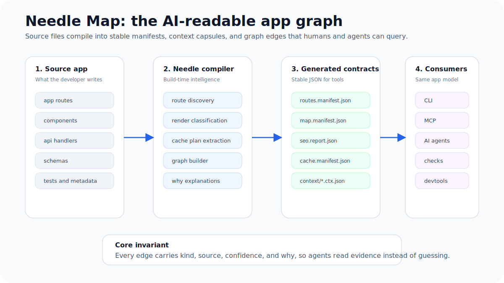

# NeedleStart

**The app-graph-native, SEO-first React framework for humans and AI agents.**

NeedleStart gives you familiar React meta-framework ergonomics: file-based routes, layouts, SSR/SSG, metadata, APIs, and deployment adapters. It adds the missing layer modern large apps need: a first-class semantic app graph that explains routes, render modes, cache behavior, SEO surfaces, tests, ownership, generated files, and safe edit boundaries.

Your app ships with a map.

Build like Next.js.

Type like TanStack.

Ship fast with Bun and Vite.

Let humans and AI agents understand, audit, change, and verify your app through structured framework data instead of spelunking the whole repo.

<p align="center">
  
</p>

NeedleStart is an app-graph-native, SEO-first React framework for building fast, large-scale web applications with a semantic map of every route, component, API, schema, test, cache, content, ownership, and risk relationship.

The goal is not to clone Next.js. The goal is to win a newer category:

> The React framework where your app ships with a map.

## Current Repository Status

This checkout is in Phase 1: monorepo scaffold. The product language below describes target framework behavior unless a section explicitly marks behavior as current.

Current implemented scope is the Bun workspace scaffold, package placeholders, shared core types, CI, and verification scripts. Route discovery, rendering, CLI behavior, runtime adapters, Needle Map generation, MCP tools, and safe edits remain planned.

## Product Thesis

Modern React applications fail when they become too large to reason about. Routes drift away from tests, components drift away from schemas, SEO regressions hide inside client-heavy rendering, cache behavior hides behind framework magic, and AI agents waste context guessing how files relate to each other.

NeedleStart exists to make the framework itself the map of the application.

## The Map

Needle Map is the AI-readable app graph. It connects routes, layouts, components, APIs, schemas, tests, metadata, cache tags, generated files, owners, and risk into stable JSON contracts.

The point is not a pretty visualization. The point is that every tool reads the same evidence.

<p align="center">
  
</p>

A route context capsule gives humans and AI agents the exact slice of the app they need: source files, render mode, SEO status, cache plan, related components, checks, allowed edit surfaces, and `why` explanations.

## Quick Start

Planned command once app creation behavior exists:

```bash
bun create needle my-app
cd my-app
needle dev
```

Generated apps should also expose package scripts:

```bash
bun run dev
bun run build
bun run start
```

This repository is not yet at package-publish stage. The user-facing create/dev commands above remain target UX rather than verified local commands.

Planned CLI surface:

```bash
needle dev
needle build
needle start
needle routes
needle inspect
needle check
needle seo
needle map
needle agent
needle mcp
needle edit
needle migrate
needle bench
```

Repository maintenance commands now available in this checkout:

```bash
bun install
bun test
bun run typecheck
bun run docs:check
bun run structure:check
bun run performance:check
bun run check
```

These commands verify the package scaffold, documentation links, root docs metadata, docs navigation coverage, package-map/build-plan/backlog alignment, planned CLI command surface and prefix consistency, status-drift guardrails, config/adapter contract terms, structure rules, shared-core type ownership, shared-core scaffold terminology, performance-claim guardrails, TypeScript surface, and placeholder tests. They do not prove route discovery, rendering, CLI behavior, runtime adapters, Needle Map generation, MCP tools, or safe edits.

## Key Features

- App-graph-native core: Needle Map, context capsules, stable manifests, MCP read tools, and safe edit transactions.
- Explainable framework behavior: `needle inspect why` should show why routes are static, SSR, cached, indexable, or risky.
- SEO by default: public routes ship with meaningful HTML, metadata, sitemaps, structured data, audits, and accessibility-aware diagnostics.
- No invisible caching: every cacheable route, API, component, or function exposes a cache plan and cache tags.
- Hot API paths: generated validators, serializers, and micro-caching for performance-critical API routes.
- Explicit render modes: `staticPage()`, `prerender()`, `ssr()`, `stream()`, `clientOnly()`, ordinary `app/api/` routes, and `apiHot()`.
- Bun and Vite foundation: fast runtime with frontend ecosystem leverage.
- Large-app safety: ownership, affected checks, dependency graph, route budgets, package boundaries, and risk visibility.
- Agent-safe workflows: safe edits are AST-based, previewable, logged, check-backed, and reversible.

## Safe Edits

AI agents should not blindly write to a framework app. NeedleStart's edit path is designed as a transaction: validate, preview, regenerate the affected graph slice, run affected checks, apply, log, and support rollback.

<p align="center">
  
</p>

## Positioning

NeedleStart should be explained in this order:

1. App-graph-native: the framework where the application explains itself.
2. SEO-safe, cache-explicit, and fast by default.
3. Agent-safe workflows through stable JSON, MCP, context capsules, and safe edits.
4. Familiar React meta-framework ergonomics.

## Wedge

NeedleStart combines:

- A semantic app map as a first-class framework primitive.
- Explicit render and cache behavior with `why` explanations.
- Next-level routing familiarity.
- TanStack-level type-safety ambition.
- Bun-speed runtime paths.
- Vite and Rolldown ecosystem leverage.
- SEO-first public HTML.
- Agent-native development through stable contracts.
- Safe edit transactions instead of free-form agent writes.
- A hot API path for performance-critical endpoints.

## Core Promise

Build like a familiar React meta-framework.

Type like a route-safe full-stack toolkit.

Ship static HTML whenever possible.

Run server paths through a small adapter-aware runtime when needed.

Ask the framework why a route renders, caches, indexes, bundles, or breaks the way it does.

Let humans and agents inspect and modify the app through structured framework data instead of reading the whole repository.

## Differentiators

| Differentiator | Why it matters |
| --- | --- |
| App-graph-native framework core | The planned framework emits a structured map of routes, components, APIs, schemas, tests, SEO, cache tags, ownership, generated files, and risk. |
| Needle Map | Humans and agents can ask what uses this, what breaks if this changes, which tests should run, and which routes are affected. |
| Explainable render/cache behavior | `why` fields and inspect commands reduce hidden framework magic. |
| SEO engine built in | Public routes ship with metadata, canonical URLs, sitemap support, robots output, structured data, meaningful HTML, and audits. |
| Route-mode compiler | Every route compiles to static, prerendered, SSR, streaming SSR, client-only, API, or hot API mode. |
| Hot API path | Selected API routes bypass generic framework handling through generated handlers, validators, serializers, and caches. |
| Agent-safe edit system | Agents use scoped, previewable, check-backed, reversible transactions rather than broad file edits. |
| Large-app safety | Ownership, affected tests, route budgets, dependency boundaries, and agent permissions are first-class. |
| Vite ecosystem first | NeedleStart uses Vite/Rolldown for the frontend build and keeps framework intelligence in the Needle compiler. |

## Strategic Technology Stack

NeedleStart starts with:

- Bun for package management, test execution, local workflow, and the default production adapter path.
- Vite/Rolldown for React frontend builds, HMR, CSS, assets, and ecosystem compatibility.
- A custom Needle compiler for route graph, render modes, SEO graph, agent context, app map, API codegen, cache plans, and deploy manifests.
- Adapter packages for production output: Bun first, then Node and static paths early enough to reduce adoption friction.
- Stable JSON manifests as shared contracts for CLI, runtime adapters, MCP, devtools, benchmarks, docs, and agents.
- Additional deployment adapters later.

The framework should avoid building a custom bundler until the app-graph and agent-safe wedge is proven.

## Monorepo Target Structure

```txt
needlestart/
  package.json
  bun.lockb
  tsconfig.base.json
  AGENTS.md
  README.md
  VISION.md
  ARCHITECTURE.md
  CONTRIBUTING.md
  packages/
    create-needle/
    cli/
    core/
    compiler/
    vite-plugin/
    react/
    router/
    seo/
    map/
    agent/
    mcp/
    cache/
    schema/
    devtools/
    adapters/
      bun/
      node/
      static/
  examples/
    basic/
    blog-seo/
    api-route/
    hot-api/
    static-export/
    adapter-node/
    ecommerce/
    dashboard-client/
    agent-demo/
    docs-site/
  playgrounds/
    large-app-fixture/
  tests/
    integration/
    fixtures/
    performance/
  docs/
```

Planned example paths are `examples/basic/`, `examples/blog-seo/`, `examples/api-route/`, `examples/hot-api/`, `examples/static-export/`, `examples/adapter-node/`, `examples/dashboard-client/`, `examples/ecommerce/`, `examples/agent-demo/`, `examples/docs-site/`, and `playgrounds/large-app-fixture/`. These paths are target inventory only until the directories, commands, tests, generated artifacts, and status labels exist.

Adapter package paths are `packages/adapters/bun`, `packages/adapters/node`, and `packages/adapters/static`.

## Product Layers

NeedleStart is built as five layers:

1. Developer framework: file routes, layouts, React rendering, metadata, API routes, and CLI.
2. Compiler: route graph, render modes, server/client splitting, SEO generation, cache plans, codegen, explanations, and manifests.
3. Runtime and adapters: Bun, Node, and static output paths consume generated artifacts and serve built apps.
4. Agent Kernel: app-local `AGENTS.md` generation, context capsules, MCP server, safe edits, plans, and diagnostics.
5. Needle Map: semantic dependency graph, impact analysis, affected checks, visual map, ownership, cache, SEO, and risk.

The runtime must stay small. Build-time compiler output should carry the complexity.

## Prototype Goal

The first public prototype should prove:

1. A developer should be able to create an app with one command.
2. The app should have file-based routes.
3. Routes should render React.
4. Public pages should be SEO-safe by default.
5. Static and SSR routes should both work.
6. API routes should work.
7. Hot API routes should use generated validators and serializers.
8. The framework should generate `.needle/routes.json` and `.needle/render-manifest.json`.
9. The framework should explain route, render, cache, and SEO decisions in stable JSON.
10. The framework should generate a semantic Needle Map.
11. The framework should expose read-only MCP tools for agents.
12. An AI agent should be able to inspect routes, edit metadata safely, run affected checks, and report the mutation log.
13. Build output should run on the Bun adapter, with Node and static adapter paths documented.

Terminology: the first working slice is smaller and is intended to prove create app, SEO-safe pages, `@needle/adapter-bun` serving, a basic map, agent inspection, and safe metadata edit. The first public prototype is the broader demo target listed above.

## First Prototype Sequence

1. Monorepo skeleton.
2. Core data model.
3. Adapter package baseline.
4. Route discovery.
5. Stable CLI JSON envelope.
6. `needle inspect` and `needle inspect why`.
7. Vite dev integration.
8. React SSR and hydration.
9. Layouts and params.
10. Static build.
11. Adapter-aware `@needle/adapter-bun` server output.
12. Metadata and SEO audit.
13. Cache metadata baseline.
14. API routes.
15. Hot API schema path.
16. Needle Map file graph.
17. Agent context.
18. MCP read-only server.
19. Safe metadata edit.
20. Node adapter baseline.
21. Migration prototype.
22. Benchmark evidence command.

## Public API Draft

```ts
import { defineMeta, staticPage } from "needlestart"

export const render = staticPage()

export const meta = defineMeta({
  title: "NeedleStart Demo",
  description: "A fast, SEO-first, app-graph-native React app.",
  canonical: "/",
})

export default function HomePage() {
  return (
    <main>
      <h1>Build fast React apps that ship with a map</h1>
    </main>
  )
}
```

```ts
import { apiHot, schema } from "needlestart"

export const render = apiHot({
  validate: true,
  serialize: "generated",
  cache: { ttl: "100ms" },
})

export const params = schema.object({
  id: schema.uint64(),
})

export const response = schema.object({
  id: schema.uint64(),
  name: schema.string(),
  plan: schema.enum(["free", "pro", "enterprise"]),
})

export async function GET({ params }) {
  return {
    id: params.id,
    name: "Ada",
    plan: "pro",
  }
}
```

## Documentation

Start here:

- [Vision](VISION.md)
- [Architecture](ARCHITECTURE.md)
- [Contributing](CONTRIBUTING.md)
- [Agent Rules](AGENTS.md)
- [Documentation Hub](docs/README.md)
- [Public Website Content](docs/public/README.md)
- [First Contribution Path](docs/first-contribution.md)
- [Project Status](docs/status.md)
- [Getting Started](docs/getting-started.md)
- [Guides](docs/guides.md)
- [API Reference](docs/api-reference.md)
- [CLI JSON Contract](docs/cli-json-contract.md)
- [Diagnostics Contract](docs/diagnostics-contract.md)
- [Manifest Contracts](docs/manifest-contracts.md)
- [Configuration Contract](docs/config-contract.md)
- [Adapter Contract](docs/adapter-contract.md)
- [Examples And Templates Contract](docs/examples-contract.md)
- [Examples Catalog](docs/examples-catalog.md)
- [File Conventions](docs/file-conventions.md)
- [Routing Contract](docs/routing-contract.md)
- [API Route Contract](docs/api-route-contract.md)
- [Schema Contract](docs/schema-contract.md)
- [Cache Contract](docs/cache-contract.md)
- [SEO Contract](docs/seo-contract.md)
- [Accessibility Contract](docs/accessibility-contract.md)
- [Security Contract](docs/security-contract.md)
- [Threat Model](docs/threat-model.md)
- [Performance Contract](docs/performance-contract.md)
- [Benchmark Fixtures](docs/benchmark-fixtures.md)
- [Documentation Standard](docs/documentation-standard.md)
- [Documentation Freshness Policy](docs/docs-freshness-policy.md)
- [Documentation Verification](docs/docs-verification.md)
- [Testing Contract](docs/testing-contract.md)
- [Public Frontmatter Standard](docs/public-frontmatter-standard.md)
- [Documentation Research Notes](docs/documentation-research.md)
- [Public Docs Site Architecture](docs/public-docs-site-architecture.md)
- [Docs Site Build Plan](docs/docs-site-build-plan.md)
- [Phase 1 Build Plan](docs/phase-1-build-plan.md)
- [Product Build Readiness](docs/product-build-readiness.md)
- [Versioning And Upgrades](docs/versioning-and-upgrades.md)
- [Roadmap](docs/roadmap.md)
- [Package Map](docs/package-map.md)
- [Needle Map](docs/needle-map.md)
- [App Graph Visual Map](docs/app-graph-visual.md)
- [Risk Mitigation](docs/risk-mitigation.md)
- [Engineering Standards](docs/engineering-standards.md)
- [Speed Strategy](docs/speed-strategy.md)
- [Speed Decisions](docs/speed-decisions.md)
- [Speed Capability Audit](docs/speed-capability-audit.md)
- [Documentation Audit](docs/documentation-audit.md)
- [Docs Maintenance Checklist](docs/docs-maintenance-checklist.md)
- [Machine-Readable Documentation](docs/machine-readable-docs.md)
- [Maintainer Guide](docs/maintainer-guide.md)
- [Adapter Architecture](docs/adapters.md)
- [Safe Edit Transactions](docs/safe-edit-transactions.md)
- [Migration Tooling](docs/migration.md)
- [Prototype Acceptance Demo](docs/prototype-acceptance.md)
- [Review Checklist](docs/review-checklist.md)
- [Architecture Decision Records](docs/decisions/README.md)
- [Implementation Checklists](docs/checklists/README.md)
- [Phase 1 Scaffold Checklist](docs/checklists/phase-1-scaffold.md)
- [Adapter Implementation Checklist](docs/checklists/adapter-implementation.md)
- [Performance Evidence Checklist](docs/checklists/performance-evidence.md)
- [Glossary](docs/glossary.md)
- [Task Template](docs/templates/task-template.md)
- [AI Skill Playbooks](docs/skills/README.md)
- [AI Subagent Roles](docs/subagents/README.md)
- [Governance](GOVERNANCE.md)
- [Security Policy](SECURITY.md)
- [Code of Conduct](CODE_OF_CONDUCT.md)

## Current Status

This repository is in Phase 1: monorepo scaffold.

The repository now has a Bun workspace, package placeholders, shared core types, CI, and enforcement scripts for docs, structure, performance-claim hygiene, type checking, and placeholder tests.

No framework runtime implementation exists yet. Route discovery, rendering, CLI behavior, runtime adapters, Needle Map generation, MCP tools, and safe edits remain planned. The next implementation stage is Phase 1A: shared core data model expansion, followed by route discovery.

## Philosophy

NeedleStart treats the semantic app graph and agent collaboration as first-class concerns from day one, not late add-ons. The compiler does the heavy lifting so the runtime stays small and predictable.

The project was initially shaped with AI-assisted architecture and roadmap planning. Implementation and release decisions remain human-accountable, with agents expected to work through documented contracts, tests, and safety checks.

## License

MIT.
