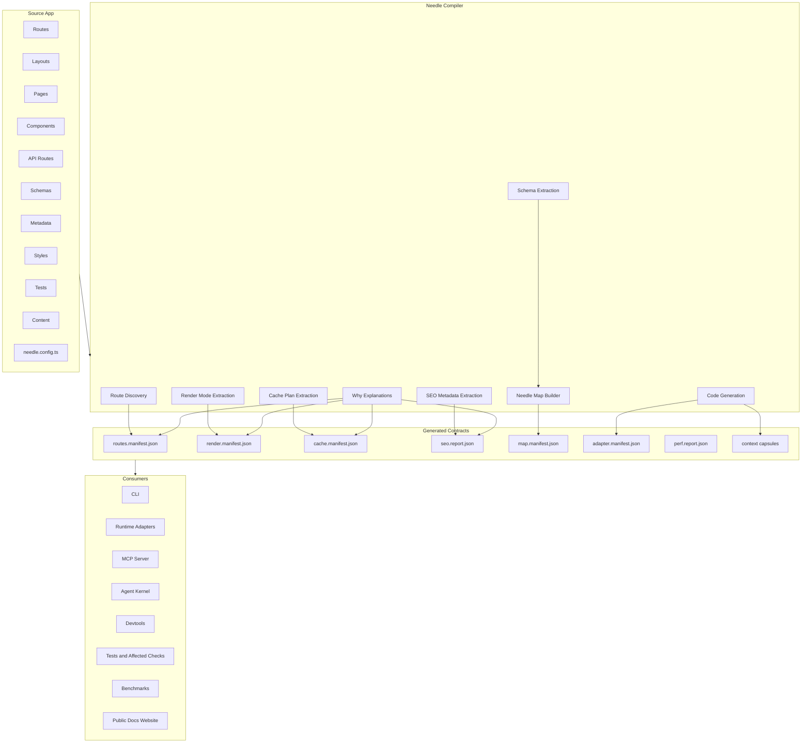
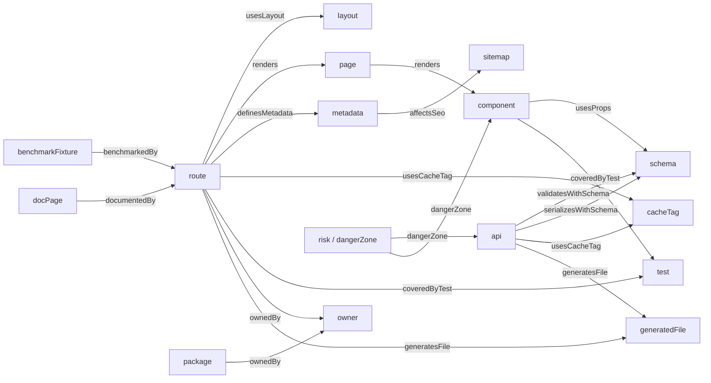
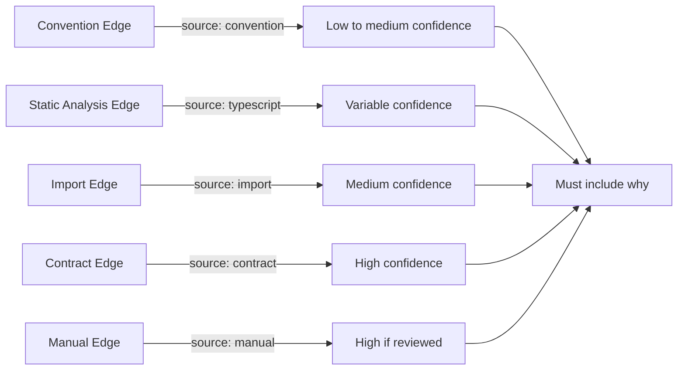
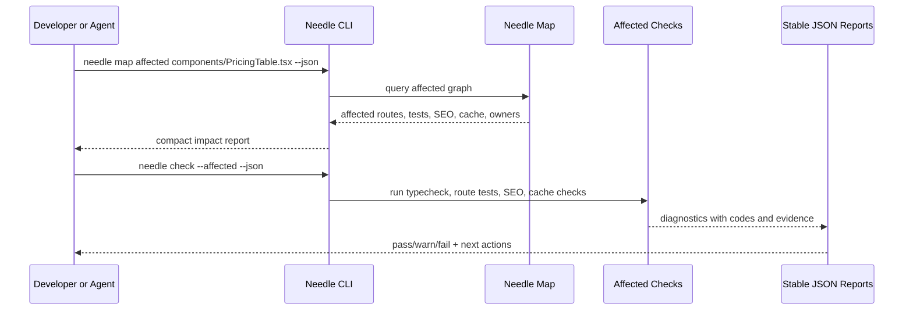
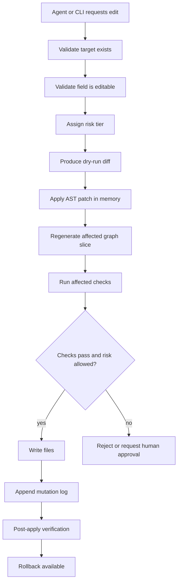
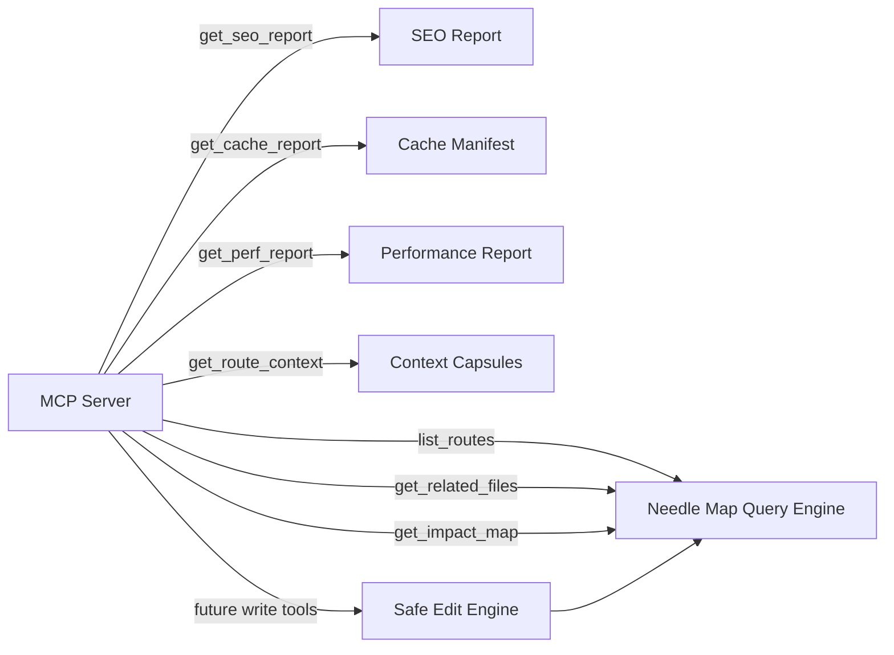
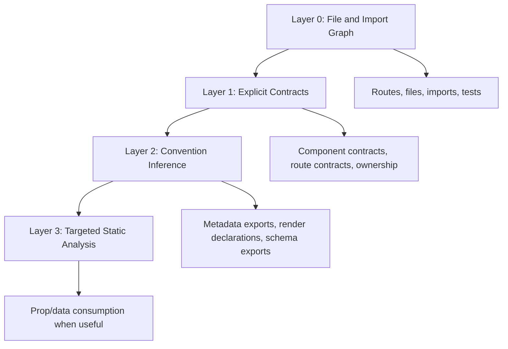
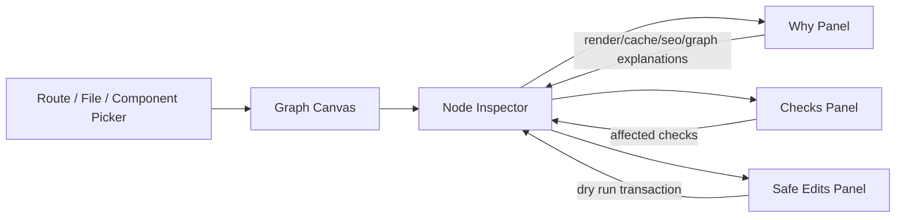
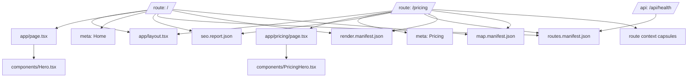

# App Graph Visual Map

This document gives a visual representation of the app graph NeedleStart is building.

NeedleStart's product promise is:

```txt
Your app ships with a map.
```

That map is not just a diagram. It is a generated, queryable, explainable contract shared by the compiler, CLI, runtime adapters, SEO engine, cache system, schemas, Agent Kernel, MCP, tests, benchmarks, public docs, and future devtools.

The diagrams below use Mermaid so they render directly on GitHub.

## 1. App Graph as Product Spine



## 2. Core Graph Node Families



## 3. Route-Level Map Example

This is the shape a developer or agent should be able to inspect for one route.

```mermaid
flowchart TB
  Route[/route: /pricing/]
  File[app/pricing/page.tsx]
  Layout[app/layout.tsx]
  Hero[components/PricingHero.tsx]
  Table[components/PricingTable.tsx]
  FAQ[components/FAQ.tsx]
  Meta[meta: Pricing | Acme]
  Cache[cache: static]
  Render[render: staticPage]
  SEO[seo: pass]
  Test1[pricing.test.tsx]
  Test2[seo-pricing.test.ts]
  Owner[owner: growth-team]
  GeneratedHTML[dist/public/pricing/index.html]
  Ctx[.needle/context/pricing.ctx.json]

  Route -->|source| File
  Route -->|usesLayout| Layout
  File -->|renders| Hero
  File -->|renders| Table
  File -->|renders| FAQ
  Route -->|definesMetadata| Meta
  Route -->|hasCachePlan| Cache
  Route -->|hasRenderMode| Render
  Meta -->|affectsSeo| SEO
  Route -->|coveredByTest| Test1
  SEO -->|coveredByTest| Test2
  Route -->|ownedBy| Owner
  Route -->|generatesFile| GeneratedHTML
  Route -->|generatesContext| Ctx
```

Expected `needle inspect why route /pricing` explanation:

```txt
/pricing is static because the route declares staticPage(), metadata is statically analyzable, and no request-time APIs were detected.
/pricing is indexable because it has title, description, canonical URL, meaningful initial HTML, and sitemap inclusion.
/pricing is low-risk for metadata edits because meta fields are declared safe-editable and affected checks are available.
```

## 4. Edge Confidence Model

Needle Map should be honest about how it knows something.



Every edge must include:

```ts
{
  kind: EdgeKind
  source: "compiler" | "import" | "typescript" | "contract" | "convention" | "manual"
  confidence: number
  why: string
}
```

## 5. Affected Change Flow

This is the developer and AI-agent value loop.



## 6. Safe Edit Transaction Flow



Safe edits are not broad agent writes. They are transactions.

## 7. How MCP Uses the Map



Initial MCP tools should be read-only. Write tools must route through safe edit transactions.

## 8. Map Layers Over Time



Rules:

- Layer 0 must be deterministic and fast.
- Layer 1 is highest-confidence semantic truth.
- Layer 2 must explain conventions.
- Layer 3 must not block normal builds by default.
- Missing contracts produce low-confidence edges, not confident guesses.

## 9. Future Devtools View

This is the eventual visual UI shape. The CLI and manifests should work first.



The visual devtools should not outrun the query engine. Pretty maps are useful only after the graph is reliable.

## 10. First Prototype Visual Target

The first prototype should be able to show this graph for a small app:



The visual should make the product instantly legible:

```txt
Routes connect to files.
Files render components.
Components connect to schemas, tests, SEO, cache, and owners.
The compiler emits manifests.
Agents and humans query the same app graph.
```
